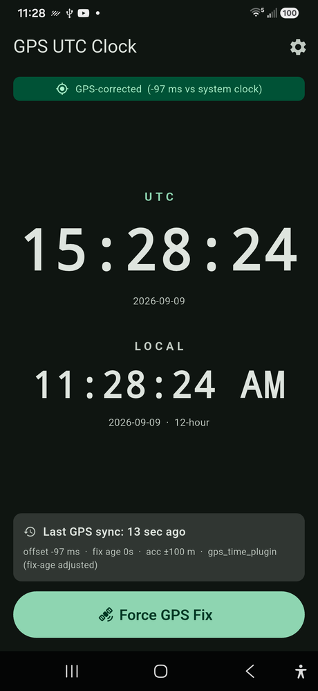
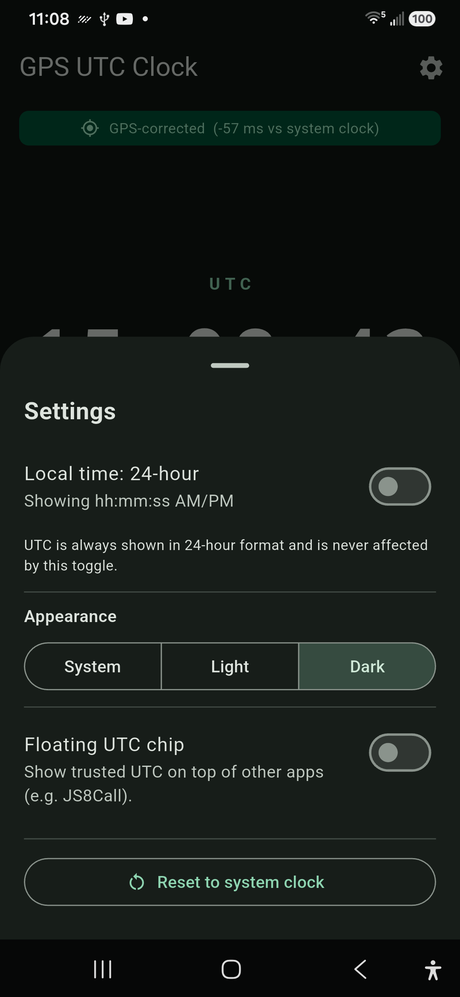
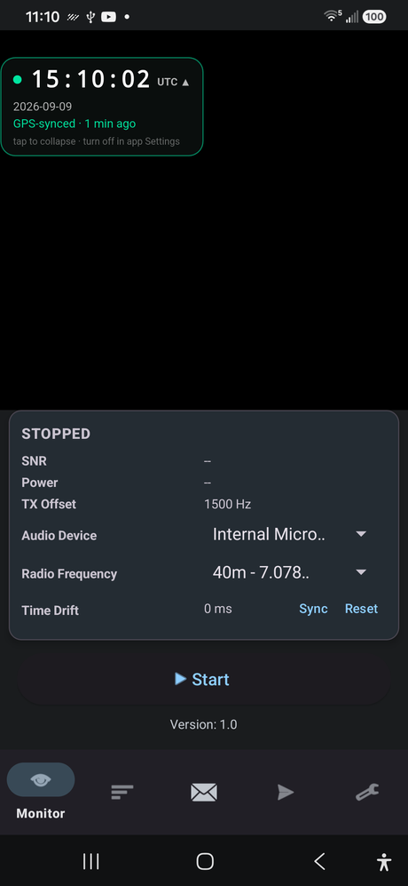
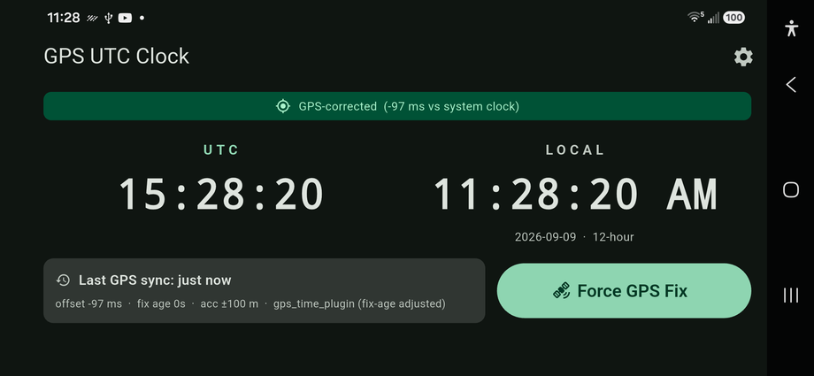

# GPS UTC Clock

A single-screen Flutter utility for verifying system-clock accuracy for **JS8Call**
use when off-grid (no cell/Wi-Fi NTP available). It shows UTC and local time and can
correct the displayed clock from a fresh GPS satellite fix.

Android first; the code is structured so an iOS build is a small change (see below).

---

## ⬇️ Download the APK

### **[Download gps-utc-clock.apk](https://github.com/doodlecomms/gps_utc_clock/releases/latest/download/gps-utc-clock.apk)**

[](https://github.com/doodlecomms/gps_utc_clock/releases/latest)
[](https://github.com/doodlecomms/gps_utc_clock/releases/latest/download/gps-utc-clock.apk)

That link always serves the newest release. Or browse every version on the
**[Releases page](https://github.com/doodlecomms/gps_utc_clock/releases)** (also
linked in the right-hand sidebar of the repo home page).

**Installing:** open the `.apk` on your Android phone and allow "install unknown
apps" for whatever opened it (browser / Files). It's signed with a debug key, so
Android warns about the source — expected for a sideloaded utility.

---

## Screenshots

| Main (GPS-synced) | Settings | Floating chip over JS8Call |
| --- | --- | --- |
|  |  |  |



---

## Build from source

```bash
flutter pub get
flutter run          # with an Android device connected
```

Tested on Android 16 (Samsung SM-A156U1). Minimum Android API 24 (required by
`gps_time_plugin`).

## What it does

| Element | Behaviour |
| --- | --- |
| **UTC** | Large digits, **always** `HH:mm:ss` 24-hour. Hard-coded formatter — never inherits the device 12/24-hour setting. |
| **Local** | Digits below UTC. 12-hour `hh:mm:ss AM/PM` or 24-hour `HH:mm:ss`, chosen by the in-app toggle only (not the system setting). Defaults to **12-hour**, persisted via `shared_preferences`. |
| Both clocks | Tick once per second. Driven by the system clock until a GPS sync applies an offset. |
| **Force GPS Fix** | Requests a fresh, high-accuracy fix: `LocationAccuracy.best` + `forceLocationManager: true` (legacy Android LocationManager = real GPS provider, not fused/network, not last-known). 60 s timeout. |
| **Last GPS sync** | Live "x min ago" / "Never", plus offset, fix age, accuracy and which mechanism produced the offset. |
| Progress / errors | Spinner + "Searching for satellites…" while fixing; clear error state on timeout/denied/services-off with retry. |
| Layout | Portrait: UTC emphasised above LOCAL. Landscape: the two clocks side by side. Scrolls if the viewport is too short (split-screen). |
| Settings (gear → bottom sheet) | Local 12/24-hour toggle; appearance System/Light/Dark (defaults to Dark); floating UTC chip (Android); "Reset to system clock" when a sync is active. All persisted via `shared_preferences`. |

## Floating UTC chip (Android)

Settings → **Floating UTC chip** shows a small always-on-top pill with the
GPS-corrected UTC time over any other app — handy for checking or nudging
**JS8Call**'s clock (its Monitor screen has a manual *Time Drift* field, and
Settings → Timing → *Auto time sync*) without switching apps.

- Amber dot = system clock, green dot = GPS-synced. Tap the chip to expand
  (date + "synced N min ago"); tap again to collapse. Drag it anywhere.
- **First time you enable it**, Android opens its *"Appear on top" / "Display
  over other apps"* screen — flip the switch on for GPS UTC Clock and go back.
  After that the in-app toggle just works.
- Turn it off from the same Settings switch. (An overlay window can't close
  itself, so there is no close button on the chip.)

## Trusted-time math

`geolocator` alone exposes only the raw fix timestamp, not the monotonic clock, so
it can't tell a fresh fix from a stale one. This app uses
[`gps_time_plugin`](https://pub.dev/packages/gps_time_plugin) as the primary source:
on Android it combines the fix's UTC timestamp with `SystemClock.elapsedRealtimeNanos()`
to produce a **fix-age-adjusted** trusted time.

- Preferred: `offset = plugin.trustedTime − plugin.deviceTime` (same emission).
- Fallback (plugin unavailable): `offset = fixTimestamp − deviceTimeWhenReceived`.
  A forced high-accuracy `getCurrentPosition` drives the GNSS hardware and returns
  a *current* fix, so we treat it as fresh. Without the monotonic clock there's no
  way to separate a stale fix from a wrong system clock, so the fallback doesn't
  try — it just trusts the fix timestamp.

`trustedUtcNow() = DateTime.now().toUtc() + offset`. The offset and last-sync time
are in-memory only; a restart falls back to the system clock until the next fix.
Both offset paths are pure functions (`gpsOffsetFromTrustedTime`,
`gpsOffsetFromRawFix`) covered by `test/gps_offset_test.dart`.

## Files

- `lib/main.dart` — app root, wires up services, overlay entry point.
- `lib/clock_screen.dart` — the single screen + settings bottom sheet.
- `lib/gps_time_controller.dart` — GPS sync workflow, offset calculation, state.
- `lib/settings_service.dart` — persisted 12/24-hour, theme-mode, overlay prefs.
- `lib/time_format.dart` — hand-rolled (locale-free) formatters.
- `lib/utc_overlay.dart` — the floating chip widget (runs in its own engine).
- `lib/utc_overlay_controller.dart` — overlay permission / show-hide / offset feed.
- `tool/make_icon.py` — regenerates the launcher-icon assets from `assets/icon/GPS_UTC_icon.png`.
- `android/app/src/main/AndroidManifest.xml` — location + `SYSTEM_ALERT_WINDOW` +
  foreground-service permissions.
- `android/app/build.gradle.kts` — `minSdk` pinned to 24.

## Known limitations

- **`FOREGROUND_SERVICE_SPECIAL_USE`** (used by the overlay) needs a written
  justification for a Play Store listing. Fine for sideloading.
- The `gps_time_plugin` build applies the Kotlin Gradle Plugin, which prints a
  deprecation warning; a future Flutter may reject it until the plugin is
  updated. Builds fine today.
- The floating chip is **Android only** — there is no iOS equivalent to
  `SYSTEM_ALERT_WINDOW`.

## iOS later

The core clock has no Android-only assumptions outside `gps_time_controller.dart`'s
`AndroidSettings`, and the overlay is fully guarded behind `Platform.isAndroid`
(`flutter_overlay_window` ships no iOS code, so it's simply absent there).
`ios/Runner/Info.plist` already carries `NSLocationWhenInUseUsageDescription`.
To finish an iOS port: replace the `AndroidSettings(...)` in `forceGpsFix()` with
`AppleSettings(accuracy: LocationAccuracy.best)` (or branch on `Platform`), then
`flutter run` on iOS. Note iOS has no raw monotonic GPS time, so `gps_time_plugin`
there uses `CLLocation.timestamp` at fix receipt.

## Releasing

CI (`.github/workflows/ci.yml`) runs `dart format` check, `flutter analyze` and
`flutter test` on every push and PR.

To cut a release APK:

```bash
# bump `version:` in pubspec.yaml first, e.g. 1.1.0+4 -> 1.2.0+5
git tag v1.2.0
git push origin v1.2.0
```

`.github/workflows/release.yml` then builds `flutter build apk --release` and
attaches two copies to the GitHub Release:

- `gps-utc-clock.apk` — constant name, so
  `releases/latest/download/gps-utc-clock.apk` always resolves to the newest build
- `gps-utc-clock-vX.Y.Z.apk` — versioned copy

Signing uses the debug key; swap in a real keystore
(`android/app/build.gradle.kts` + repo secrets) before any Play Store submission.

## License

MIT — see [LICENSE](LICENSE).

